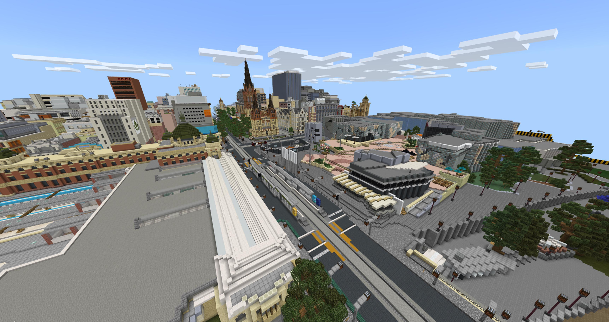
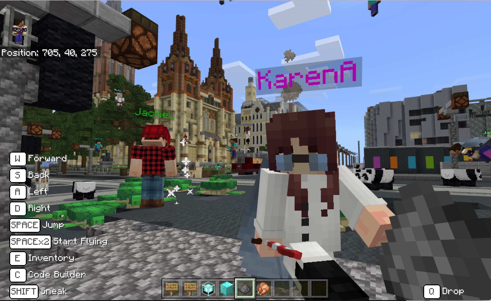
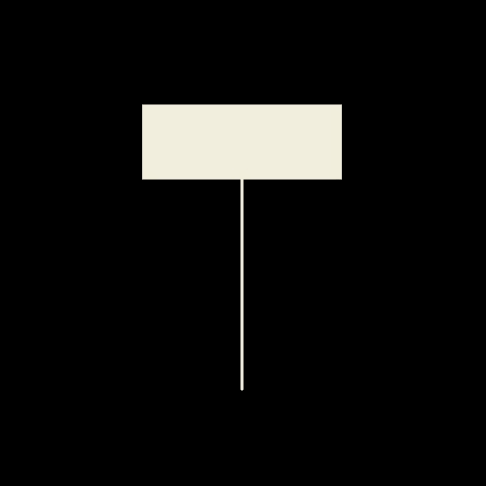
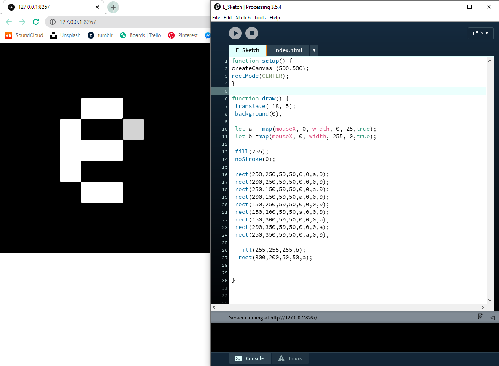

# Week One | CodeWords!

We jumped into class with an introduction to codewords!!! and a little bit about Karen and Andy with some interesting projects that they had worked on. The one that stood out to me was their work perception and their library of nonhuman books. This relation between code and type was one that I had not thought about much as words always felt very human, carefully though out and written down whereas code felt like machines and commands. This bridge that this studio attempts to connect felt new,innovative and exciting!

## Virtual Worlds
We spoke a little about virtual worlds and them being used to connect and host events. One example was [Travis Scott](https://www.youtube.com/watch?v=wYeFAlVC8qU) preforming his concert in the popular battle royal game Fortnite. To me this was particularly interesting as I thought that the pandemic would disconnect people from interacting with others in events like concerts. I felt it was an interesting result to our current limitations and this transition to online spaces will continue to happen in the future. 

We also had our own virtual world with a Minecraft [replica](http://fuse.education.vic.gov.au/Resource/LandingPage?objectId=31466a40-3da7-4b02-9d36-c3cd1bdff365) of Melbourne CBD to magnificent detail.

As a class we were put into creative mode and were able to build, explore and talk in game with other classmates. Since I had'nt visited the CBD since the start of the year it really felt nostalgic. 

>Thats me on the right above the panda! Image by Andy

This then transitioned to our group work for Brief 2, the interpretation of House of Leaves by Mark Z. Danielewski in a virtual world of our choosing. The group that I joined decided to recreate a chapter of the book in the game Animal crossing as we though it was a contrast from the horror genre of the book. 

## Into the world of P5.js
We were also asked to begin working in p5js and create a letter or initials in the coding program. I played around with this for a while implementing `sin()` waves and mapping values into my sketch to animate a transition between J and T. I began by drawing some ideas out on paper to firstly visualise how I wanted the design to look and then translated them into code through the use of shapes and lines. 

> You can visit the sketch [here](https://jamtt.github.io/Codewords/Files/JT_Sketch/). 

I also worked on another letter which was a transition between the upper and lowercase E. This one I used a `mouseX` variable to control the transition of the letter.

> You can visit the sketch [here](https://jamtt.github.io/Codewords/Files/E_Sketch/).

I had already done some work in P5js prior to this with a project called Just my Type for a design group called Ctrl+. This particular project assigned some students within the group to create an assigned letter in their style. This was also an oppertunity to learn how to use P5.js as I only knew about HTML and CSS prior. It uses some basic key pressed functions to display images and can be viewed [here](http://www.ctrlplus.club/). 
> Special thanks to Karen for helping me out with some coding questions! 

##### Next Week => <a href="Week 2">Week Two</a> | Wholesome Animal Crossing

