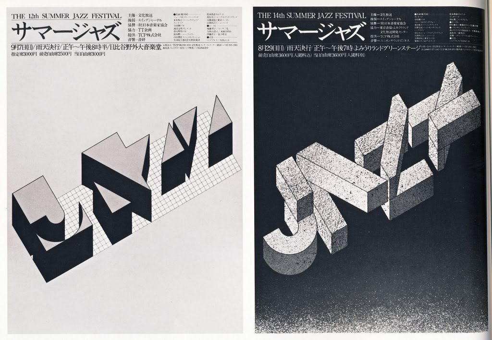
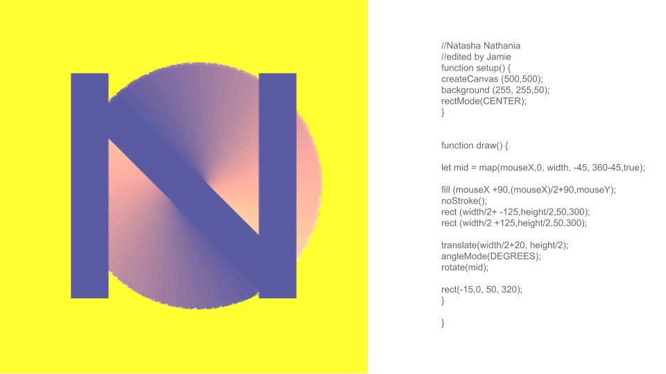

# Week Two | Wholesome Animal Crossing
This week touched into the modular typeface designs and algorithmic type creations which related to our previous letter forms we created in P5js. We also began exploring our chosen virtual world by jumping into a space together and figuring out some possible limitations.

## Takenobu Igarashi
An artist that stood out to me was Takenobu Igarashi, a graphic, product, environmental and sculpture designer who worked with lucid forms of type. Shown below are examples of his Jazz Festival posters which use a simple shapes in a certain perspective to create letterforms. Igarashi’s type design was often built from simple geometric shapes but the composition and placement of those shapes were what made his work unique and iconic. 

To see what examples of modular typefaces click [here](https://docs.google.com/presentation/d/1N2hAFp6si7UsVuPj1oMQ21_HHF858NbXZna0YQxOQio/edit#slide=id.p).

## Animal Crossing 

We continued our Brief 2 with part 3 of the book being given to us. Our group decided to test out our virtual space and test the waters for any limitations of possible hurdles to come our way. Those included getting everyone together as Animal Crossings way of connecting users was slow and clunky and the limitations with recording being 30 seconds per clip and it being recorded backwards in time. Nevertheless we still managed to all get together! To view what virtual spaces other students chose click [here](https://docs.google.com/presentation/d/1c1KexKLj99n7Z-FLky9NW8Zqkgk1uo2tdibFXJoCwYc/edit#slide=id.p).

## P5js with others
For homework we were asked to tinker with another students letter form from last week. I decided to edit @natnathania 's and make her N rotate whilst still keeping her Xmouse colour change function. It was really great to see everyone elses work and trials with the letters and creativity with how they used code and I hope theres more of this sharing code in the future! Go Collaborative learning! 

