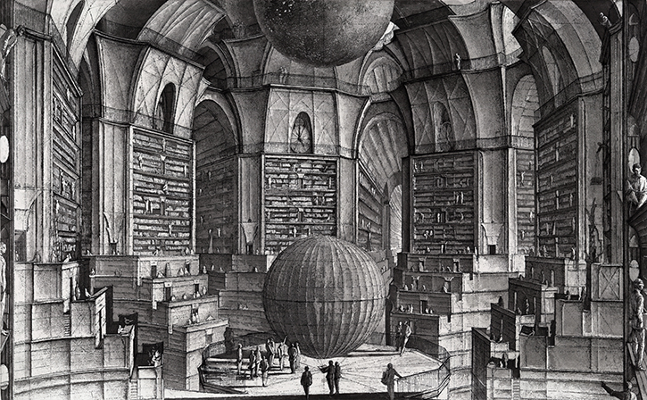
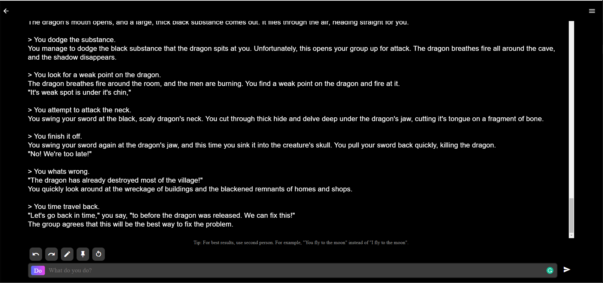

# Week Three | Electronic Lit

This week we explored what electronic literature was by scouring the internet for some examples.
The example I found was the Library of Babel, an infinite library containing everything that could ever be said with a combination of 1,312,000 characters.  

## Library of Babel
This one made me think about if it reallt was electronic literature as the other examples students posted often had words generated by AI. This concept was more to do with mathematics and is stated that the website does not simply generate and store text as its requested but every permutation is accessible at every moment, just awaiting to be discovered. The concept was created by [Jorge Luis Borges](https://en.wikipedia.org/wiki/Jorge_Luis_Borges) in a short story where he describes what it would be like from within the library. My mind hurts from thinking about this for too long. 

To see what other students found for their electronic literature click [here](https://docs.google.com/presentation/d/1QXcxFkKdzMiwNWBSdXT0LG9YNFjlzViwScTtsLMXROo/edit#slide=id.g8e5317bdfc_0_33).

## AI Dungeon
We also joined AI dungeon as a class which is an online text based choose your own adventure where generative text determines stories and events.  It was a little chaotic for all the students to be inputting actions and at one point we created an infinite loop that broke the game. I later attempted to complete a narrative by myself and surprisingly the game was smooth in responses and analysed my actions with interesting reactions. 

## Brief 2
For the continuation of brief 2, we gathered as a group to discuss how to split the roles of production and began to break down what areas of the chapter we would recreate in our virtual world. An example that we found which was a type of machinima was a [horror movie trailer](https://www.youtube.com/watch?v=bVx3Xp9OVE8) done by Evil Imp on youtube. It combined the cute aesthetic qualities of animal crossing and introduced creative in game mechanics to portray a narrative.  

##### <= [Week 2](https://github.com/Jamtt/Codewords/blob/master/Week%202/Readme.md) | Wholesome Animal Crossing
##### => [Week 4](https://github.com/Jamtt/Codewords/blob/master/Week%204/Readme.md) | Building WIP
