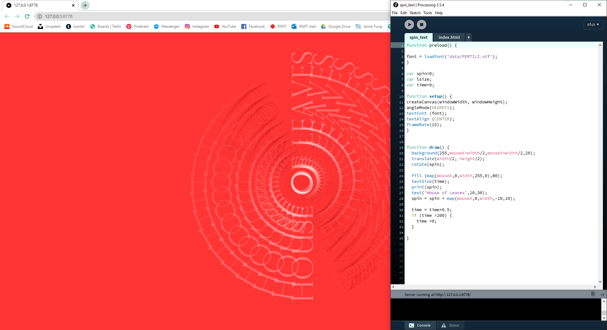
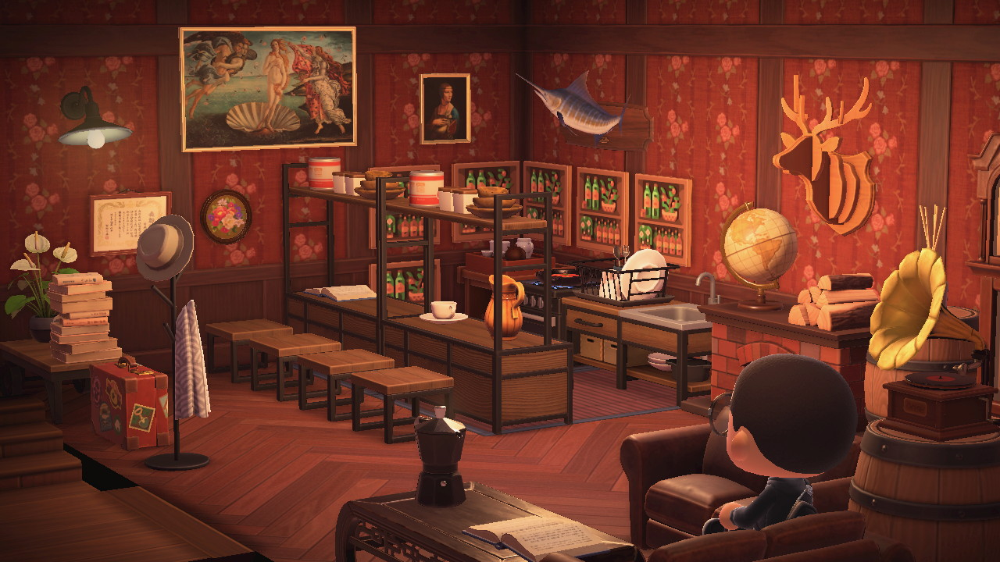
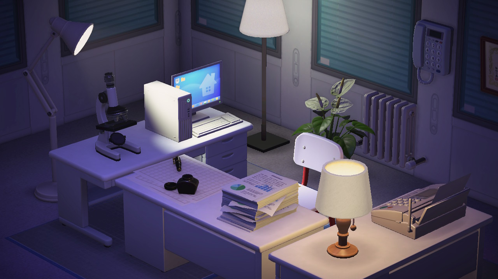

# Week Four | Building WIP

## P5js
This week Karen showed us how to import different typefaces into a sketch and we played around with some rotations.  This was a great little tutorial as since we would be working with type for our final project, it would be useful to change typefaces. 

> View the sketch [here](https://jamtt.github.io/Codewords/Files/spin_text/)

## Scene Building | Brief 2 

We also continued working in our groups for brief 2 and began building scenes that would be used in the portrayal of characters and dialogue. Building in Animal crossing was a difficult thing to do collaboratively as everyone had their own island that they could build on, however once someone visits an island, the owner can no longer move objects around.

This meant that each scene would have to be prebuilt and then filmed on. Another issue was that Animal Crossing provides no “creative mode” in which the player has unlimited items in multiplayer. This meant that all items on set were bought with in game money and that was limiting for players who were new to the game. 

##### <= [Week 3](https://github.com/Jamtt/Codewords/blob/master/Week%202/Readme.md) | Electronic Lit
##### => [Week 5](https://github.com/Jamtt/Codewords/blob/master/Week%205/Readme.md) | Showtime

