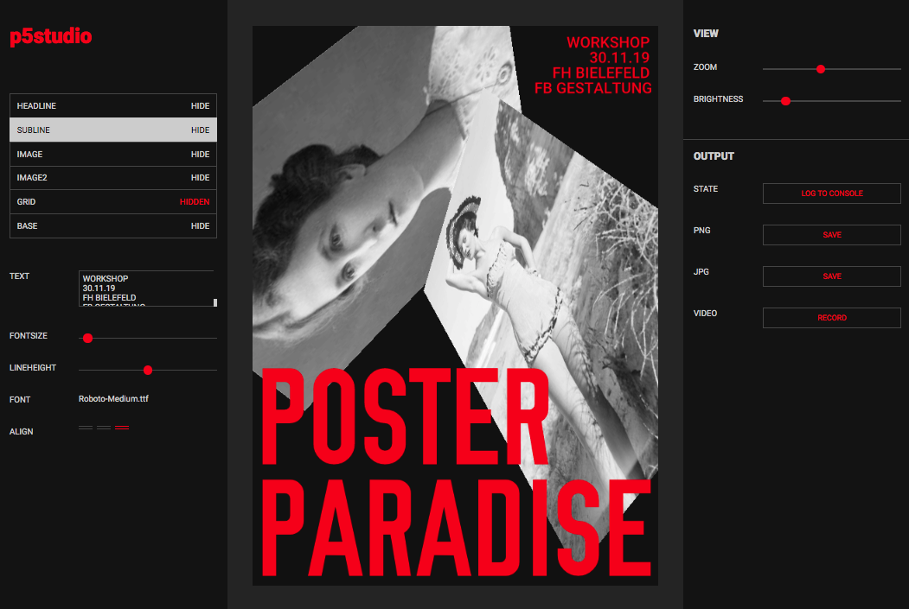

# Week Four | Building WIP

## P5js
This week Karen showed us how to import different typefaces into a sketch and we played around with some rotations.  This was a great little tutorial as since we would be working with type for our final project, it would be useful to change typefaces. 

> View the sketch [here](https://jamtt.github.io/Codewords/Files/spin_text/)

I also began to do some personal research with p5js and stumbled across Tim Rodenbroeker and his processing tutorials/ projects that he had done. I like his concept of empowering young creatives by teaching creative coding and computational thinking as I think it related pretty well with what we are exploring. Despite almost all his tutorials being in processing(Java) and not P5js(Javascript) it was still really useful watching his material and understanding a basic overview of what things would do. There were only a few substitutes I could notice and felt that the two were interchangeable at times. A favourite project of mine that he created was called p5studio where the sketch would allow users to create their own posters with limitations of fonts, colours and images that would ultimately give them all a cohesive look. This layout of buttons, sliders and dropdowns reminded me of creating music and the multiple parameters that you can use to adjust how music sounds. 

> you can visit his website [Here](https://timrodenbroeker.de/p5studio/)

## Scene Building | Brief 2 

We also continued working in our groups for brief 2 and began building scenes that would be used in the portrayal of characters and dialogue. Building in Animal crossing was a difficult thing to do collaboratively as everyone had their own island that they could build on, however once someone visits an island, the owner can no longer move objects around. 

This meant that each scene would have to be prebuilt, checked with the team and then filmed on. Another issue was that Animal Crossing provides no “creative mode” in which the player has unlimited items in multiplayer. This meant that all items on set were bought with in game money and that was limiting for players who were new to the game and had no money. We decided to do most of the building on my island as I had been playing for the longest time and had obtained a fair ammount of items to use in our preformance. However I did feel a bit bad for the others who had no money and could only contribute with the acting side of things. 

##### <= [Week 3](https://github.com/Jamtt/Codewords/blob/master/Week%203/Readme.md) | Electronic Lit
##### => [Week 5](https://github.com/Jamtt/Codewords/blob/master/Week%205/Readme.md) | Showtime

