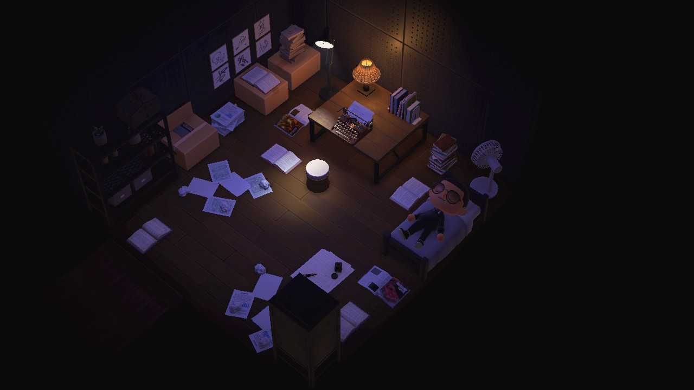

# Week 5 | Showtime

We started off this week by sharing some [rough cuts](https://www.youtube.com/watch?v=V1scKvMRQx8) of our films we had been working on! It was really great to see everyone’s progress and to see all the different virtual worlds people had to work in. I loved Win's Minecraft group and their amazing cinematography as it was done to perfection. The camera movements to the builds were exceptional. Another was the second life group and their very unsettling way of showcasing the house. There is something really creepy about the character design and movement that fits so well with the horror themes. 

There was a great range of creative interpretations from using cinematic camera angle, detailed scenes and music to portray their groups interpretation of the book. Our groups outcome was slightly rushed towards the end however the outcome was still well put together! Thanks Wholesome Animal Crossing Squad! You can view the rationale and [here](https://wiip.co/THE-HORRORS-OF-ANIMAL-CROSSING.b-MEgcptSZluo8jwq7Tsi/) where we go into detail about each charecters costume design, location design and choice of shots. 

So that was pretty much it for the first assignment. It flew by so fast and was such a different way of learning about a space that was both fun and rewarding.  I don’t get how Karen and Andy manage to think of these brilliant ideas for their classes but this is the way I want to learn. Imagine having classes in a virtual space like Minecraft instead of the regular zoom call! 

This whole project also made me realise that the possibilities of electronic literature are pretty much endless in a digital space. You could create a performance anywhere or the internet! One random example that has popped into my head is within the chatlog of a game of electronic chess! Amazing. 

## Brief 3

Now we begin to move into the second major assignment. The one where we to a switch and instead of preforming in digital space, we create! 
We were asked to pick a text from Karen and Andy’s Archive to analyse and attempt to summarise. The one I picked was “The Postmodern Condition: A report on Knowledge” written by [Jean-Francois Lyotard](https://en.wikipedia.org/wiki/Jean-Fran%C3%A7ois_Lyotard) a French philosopher.

> Thats him! [Jean-Francois Lyotard](https://en.wikipedia.org/wiki/Jean-Fran%C3%A7ois_Lyotard)

It was a deeper read that required multiple passes and dissection but to summarise, the text talks about the hypothesis that knowledge is altered by what is known as post-industrial age or postmodern age. It's a concept that measures a countries technological measure through their advances and level of development/progression. How does this have to relate to electronic literature you might ask? Thinking about Lyotard’s hypothesis, a similar progression would be the stages of civilization. That the advancement of humanity has been recorded but future is yet to be understood. In our current day and age, technology seems the most probable way we continue to advance. Lyotard continues to talk about the goals of exchanging information with two positions of the “User” and the “knower”. That as humans learn from others, they can also begin to teach and complete this cycle of exchange. However, as we continue to move towards an AI learning, it begs the question that will this be a breakthrough in the way we continue to advance into a new age or will it bring upon something that divides humans from machines. Imagine having all the knowledge your parents had downloaded into your brain as a teenager. Would that be skipping the step of exchange and allow humans to move forward faster? Or would it create chaos in the wrong hands. 

This would later be helpful when picking a text for brief 3 as each student did a summary on a different text, allowing the class to find something of interest without reading too far into a particular text. 
To view other students summaries click [here](https://docs.google.com/presentation/d/1tF9j3J75aVpLWOs6R_vCNQty8WjL-_AfgO9TgyKLoq0/edit#slide=id.p).

##### <= [Week 4](https://github.com/Jamtt/Codewords/blob/master/Week%204/Readme.md) | Building WIP
##### => [Week 6](https://github.com/Jamtt/Codewords/blob/master/Week%206/Readme.md) | Thinking In Paper
