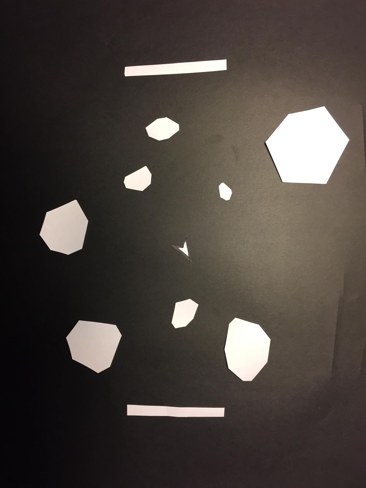

# Week Six | Thinking In Paper

## Paper Prototypes

This week we worked on a new way to think about how to code through paper prototypes! It was a method of visualising how a project would function by creating a simple sketch or verbally speaking about its interactivity. We were asked to pick a classic arcade game to recreate per group and ours did [Asteroids](https://en.wikipedia.org/wiki/Asteroids_(video_game)) designed by Ed Logg and Lyle Rains. The game had a very simple architecture and a few actions that would create reactions. One example being when the player shoots, the asteroid breaks into multiple pieces. Andy then suggested that we attempt to combine or add to our paper prototype demonstrating how easy it was to make changes.

I came up with the idea of adding pong to asteroids aka “Pongstroids” -@HamishPayne, which would turn the single player PVE game into a multiplayer PVP where the second player would attempt to either bounce asteroids towards the ship or allow them to pass onto the other side of the screen. These changes were done simply by adding two rectangles to each side of the canvas. 

## Brief 3 | Picking a Text

We then confirmed the texts would be basing our final assignment on. For myself I chose the text Viruses Are Good for You by [Julian Dibbell](https://en.wikipedia.org/wiki/Julian_Dibbell).

This was an interesting read as it shed light on how people viewed Viruses as these unknown and alien like creatures. That not knowing what it was capable of doing was scary for most people. Unlike a biological virus, these viruses are products of humans through culture, so it begs the question of why they scare us and feel so unhuman? So why did I pick this piece? I really connected with the concept of not knowing something and being afraid of it. This applies to many areas of my life where sometimes I feel its unfamiliarity makes me want to stay away from it or label it as dangerous. Despite having resources like Google, I can still feel this way at times so I felt that it could be interesting to see how to unravel and interpret this concept of familiarising one’s self with viruses in p5js.
I will continue to read through Dibbell’s article for ideas and themes in which I will translate to a paper prototype for my final brief. 

##### <= [Week 5](https://github.com/Jamtt/Codewords/blob/master/Week%205/Readme.md) | Showtime
##### => [Intermission](https://github.com/Jamtt/Codewords/blob/master/Week%207%20Intermission/readme.md) | Intermission
