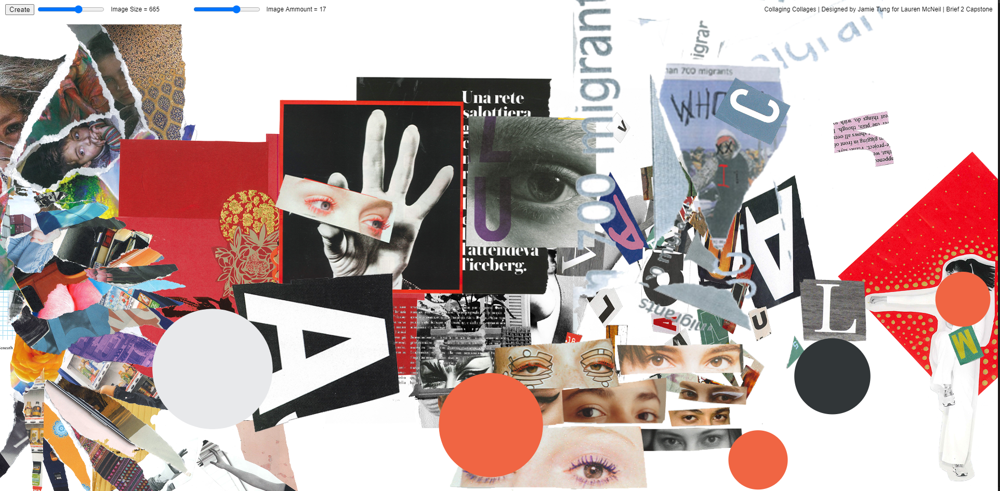
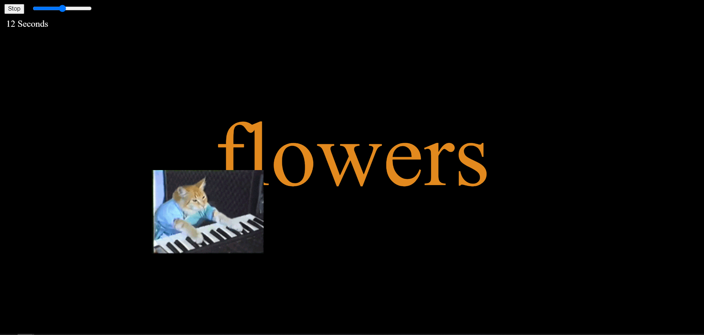

# Week Seven | Intermission

## Collaging Collages

As time wizzes by and we head into semester two break, I set myself to experiment more with p5.js and the endless possibilities it has. For another class we were assigned to create illustrations/graphics to depict a randomly assigned partner. Mine happen to enjoy collaging and embracing beauty out of trial and error so I decided to create them a Collage generator in P5.js. The code is fairly simple using some of my partners collaging images randomly placed on the canvas. It includes some sliders that can change the variables of size and amount. 

Give the project a go [here](https://jamtt.github.io/Codewords/Files/LaurenCollage/). 
This project was helpful in familiarising pseudocode and preplanning to achieve a concept. It also familiarised some new p5js functions such as buttons, sliders, for loops and much more!

## Christmas in September

Another little project I did more for myself which introduced the library of p5.sound was a project I made with the song “This time in Christmas” by Matt Duncan. This was my first time experimenting with sound on the web and I discovered the possibilities this library had to offer. I’ve always loved the concept of having typography mixed in with audio and thought this could be a good opportunity to see what I could do with this library and if I could possibly implement it into my final project. I also added piano cat in there to spice up that festive music spirit! 

Have a lookie [here](https://jamtt.github.io/Codewords/Files/MattDuncann/). 
Project uses Library p5.sound and functions such as addCue, sliders, buttons etc.
*Note that it doesn't seem to run on Safari. Music by Matt Duncan

##### <= [Week 6](https://github.com/Jamtt/Codewords/blob/master/Week%206/Readme.md) | Thinking In Paper
##### => [Week 7](https://github.com/Jamtt/Codewords/blob/master/Week%207/Readme.md) | What is Hip?
