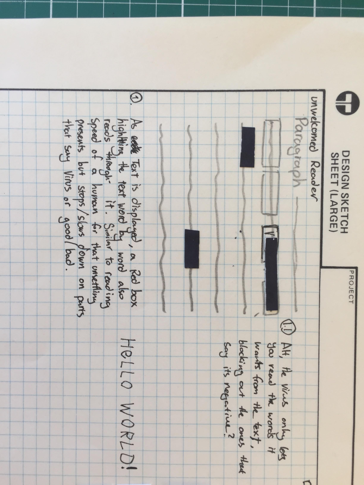
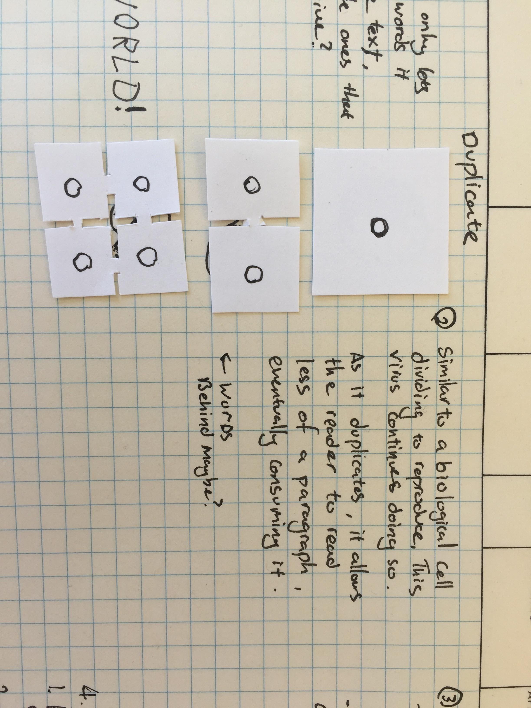
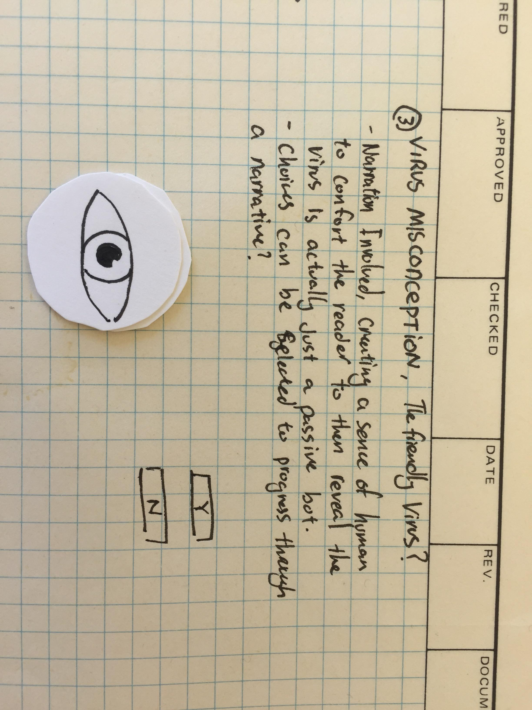
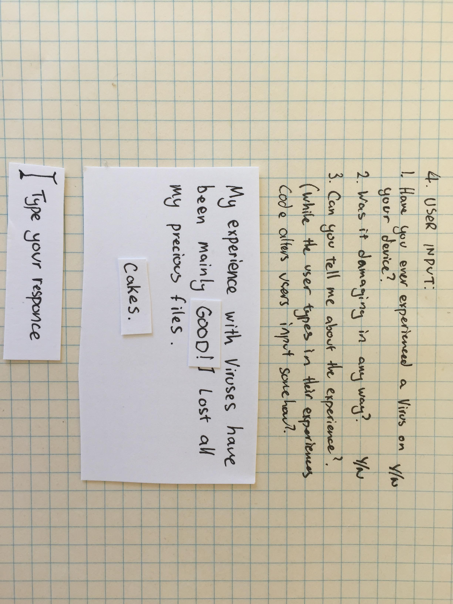
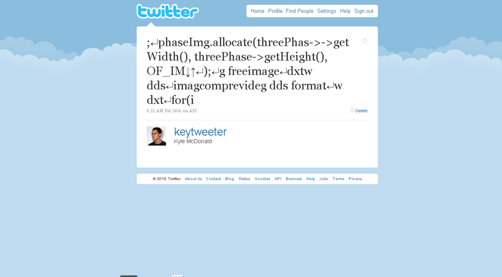
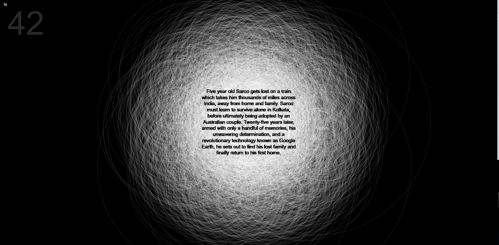
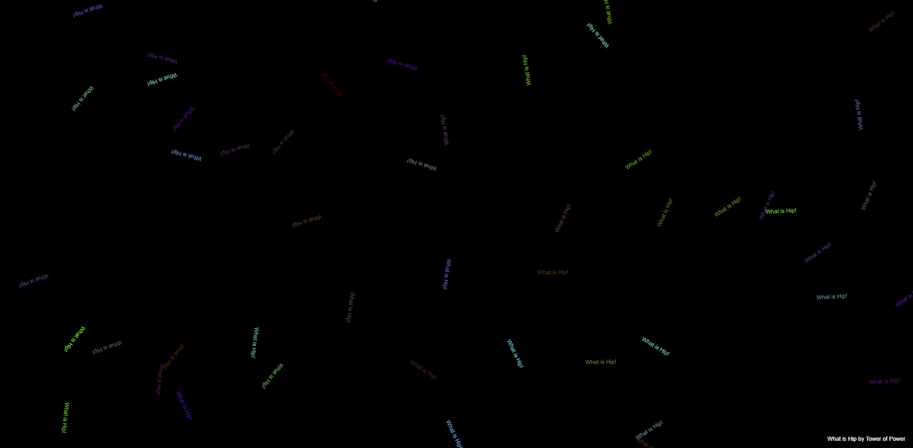

# Week 7 | What is Hip? 

## More Paper!

As we head right back into work with week 7, we discuss our paper prototypes that display the range of different ideas in quick and simple visualisations. I must be honest, I think that my paper prototypes failed as they consisted mostly of words but hopefully still conveyed the message across. As a class we broke into groups of 3 and attempted to explain our prototypes to our partners. I was with Bridie and Finn which both had really different and interesting concepts. 
Check out there progress: 

### [Finn's Github](https://github.com/FinnArundel/codewordsRMIT/tree/master/week_07)
### [Bridie's Github](https://github.com/bridieotoole/codewords/tree/master/week_06)

*My four ideas are as follows: 

1)	My first Idea was named unwelcomed Reader where essentially when a button is pressed, an article begins to display about how viruses are bad, the computer begins to censor the negative words out at around the same pace as a humans reading pace. This was to create a sense that the software was human like through the speed of reading and how people didn’t like negative things said about them. The overarching idea was to combat that disassociation we have with viruses and their culture. 

2)	Duplicate was my second idea, similar to the popular animation of two cells dividing to spread. There would also be text underneath the duplicating virus which would become more difficult to read overtime. The user would be able to move these cells to attempt to read as much as they could. This was to reflect the computer vs biological virus ideas and how they are eerily the same in many aspects. 

3)	Thirdly played on the idea that viruses are always misconceived as negative and destructive. This sketch would create a consciousness that would also have a voice and possibly some soothing music to attempt to ease the viewer and change their mind that all viruses are bad. Over a period of cycles of questions, the viruses would ask if the user still thinks negatively of viruses and only when the user says no, will the ‘friendly virus ‘leave the user alone.

4)	The fourth and final idea was a way that users could input an experience they have had with a virus into a textbox. The sketch would ask the user 2 or 3 questions and at the end, would replace any negative words with positive ones as if you had typed them out. Again, emphasizing that viruses have so much negative connotations that it wants others to perceive it as positive or neutral. 

Paper prototypes again were great for generating ideas fast with very little work required. After having our group talks we shared some links of interesting sketches that others made. One that really stuck to me was Keytweeter by Kyle McDonald. 

It’s a crazy project where McDonald records all the typing he does on his keyboard for a year with the exception of sensitive information gets posted on a twitter account. The fascinating concept of having all this information to the public has some a strange vulnerable feeling like a virus within a computer. McDonald within the documentary talks about how it was strange at the beginning but later he got use to it. Here is an example of McDonald coding as the keytweeter logging what he writes. 

> Watch the doco [here](https://vimeo.com/9922212)

## Libraries and Sound

Within Class we also spoke about p5 libraries and the one we focused on was p5.sound. It enabled sketches to play audio on the web and create interesting visuals through this analysis of audio files. We were shown how to use the function amplitude() and it could incorporated with text. We were then asked to remix our own take with p5.sound and create something that had both sound and type in it. 

My first sketch was based on the song Lion theme from the Film Lion. It just happened to be a song I was listening to at the time and inspired me to create something out of it in the moment. Some good things about the audio file was it had a build up and fair contrast with loud and soft parts creating an interesting visual. For the sketch I decided to use circles with very thin strokes which would spin on a sin wave to create interesting rotations. I guess they represented the main character searching for his lost family through use of google maps. I also added a quick map to show progress of the song on the right hand side. I firstly thought about it as a math equation being the duration of the song needing to match the height of the window but I realised that I could just use the map() function! As the circles build up the paragraph of the plot shows up as if it’s being discovered. 

> View the sketch [here](https://jamtt.github.io/Codewords/Files/Lion/)

Second sketch was a simpler approach which also used sin waves and rotate but with text and amplitude within a translate. The song was What is Hip? By Tower of Power, also another song I was listening to. I wanted this one to show how colourful and exciting the song was. I also mapped the rotate to my mouseX giving the user something to do while they listened. 

> View the sketch [here](https://jamtt.github.io/Codewords/Files/What_is_Hip/)

I hope it makes you Hip 💃

##### <= [Intermission](https://github.com/Jamtt/Codewords/blob/master/Week%207%20Intermission/readme.md) | Intermission
##### => [Week 8](https://github.com/Jamtt/Codewords/blob/master/Week%208/readme.md) | Classes in Class

