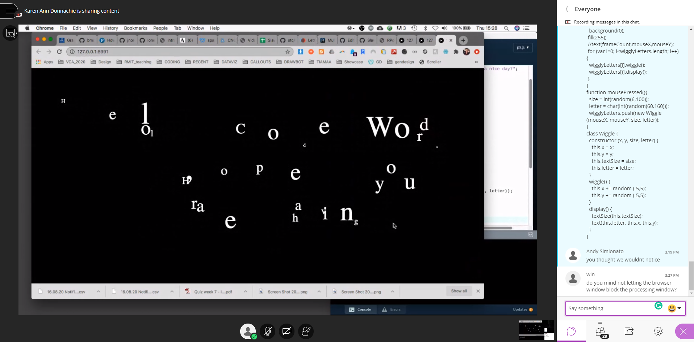

# Week 8  | Classes in Class
## Refining Paper Prototypes
From last weeks existing 4 prototypes, I took a little from each and merged them into a final design Idea which still needs some variables fleshed out. The idea is as follows and written is pseudocode: 


``` // VIRUSES AREN'T BAD I PROMISE

IF no text on the page, 
Press button.
ELSE no text will display. 

WHILE button has been pressed, 
Search for random headline about computer Viruses using an API. 

END WHILE

IF MousePressed on word, use rITA.js to change to another word
// Idea is to remove negative words from a headline

ELSE words won't change

IF you are satisfied with what is written, 
Post to twitter using another API ?

ELSE Press button to create new headline 
```

Let me break it down even further. The concept is built off Julian Dibbell’s text “Viruses Are Good for You” in which he explores the perception we humans have towards these computer viruses. There is a quote within that stands out to me the most and reads as follows 

> “Why then, after a decade of coexistence with computer viruses, does our default response to them remain a mix of bafflement and dread? Can it be that we somehow refuse to recognize in them the traces of our fellow earthlings’ shaping hands and minds? And if we could shake those hands and get acquainted with those minds, would their creations scare us any less?” 

My psudeocode attempts to bridge this answer and takes the misconception of viruses almost always being portrayed as destructive and alien and ultimately to change that. 
``` It firstly takes an existing article header that someone has written about viruses > asks the user to change any negative words within this article through rITA.js > and then pushes it out into the internet through twitter to hopefully shed more light and balance the negatives with random headlines about viruses. ```

As a class we shared all our ideas for our final projects and it was really great to see everyone’s ideas for their chosen texts. One that stood out to me was Jackie’s idea of using the camera to interact with text. By having the users head oscillate, it would slowly reveal text which is making the user work to read! You can view her idea [here.](https://github.com/jackieliiu/CODEWORDS/tree/master/Week08) 
Towards the end of seeing everyones work and consulting with Andy and Karen about our ideas, I felt that mine had many holes and flaws in it. Perhaps it wasn’t telling a narrative that I wanted it to tell and felt a little forced. 

## Classes in p5js



In todays live coding session with Karen, we explored the topic of creating classes in p5js. Classes in a nutshell allow the sketch to create individual element each with their own processes rather then creating elements as a part of a grouped command. It was a harder concept to get my mind around but Karen explaining it further really helped. Having the ability to use classes ofcourse was a big breakthrough for everyone. It gave us more control over what was being put on the page. Here is the example we worked on where we assigned mousepressed to push a new letter from within a string into the sketch. Each of these letters having a jiggle affect where they would randomly move on the x and y axis each framecount. 

## Looking into Libraries and API’s
As a result to thinking about our final and seeing everyone’s works, I began to look further into libraries and there were a couple that I thought could be possibly to incorporate into my sketch. First one being ML5.js which was a machine learning library that could take data sets , train the program and then output based on that dataset. This could possibly be teaching the machine to detect negative words within an article and blacklist them or flag them to be a different colour?
The second was ofcourse rITA.js which was more of a complicated library that involved some knowledge of English grammar which I lacked haha. Nevertheless I watched [Dan Shiffman Coding Train on rITA.js](https://www.youtube.com/watch?v=lIPEvh8HbGQ&ab_channel=TheCodingTrain&t=690s) and some of the functions included would definitely be something I could incorporate with my sketch.  
 

In terms of API’s, I’ve only used a couple but never with p5js so I had a look at the ones I was likely to use. Firstly being Twitters API would allow me to post text to an account that is linked from my code. There are some limitations including 100 posts per hour max. To my delight Dan Shiffman also has a [tutorial](https://www.youtube.com/watch?v=7-nX3YOC4OA&ab_channel=TheCodingTrain ) showing how to set up the basics of a Twitter bot.


Next would be a source for headlines about computer viruses. At first I was thinking of using a news website but was worried that 1, there wouldn’t be enough results and 2, the searches could contain lots of covid-19 related articles. Possibly grabbing headlines from a google search would be more affective but at this moment I’m not sure if its doable or not.  

Ending on a quick note, looking back on my concept, I think that it could maybe incorporate more elements from the text rather then pulling one main quote/concept out of it. 

