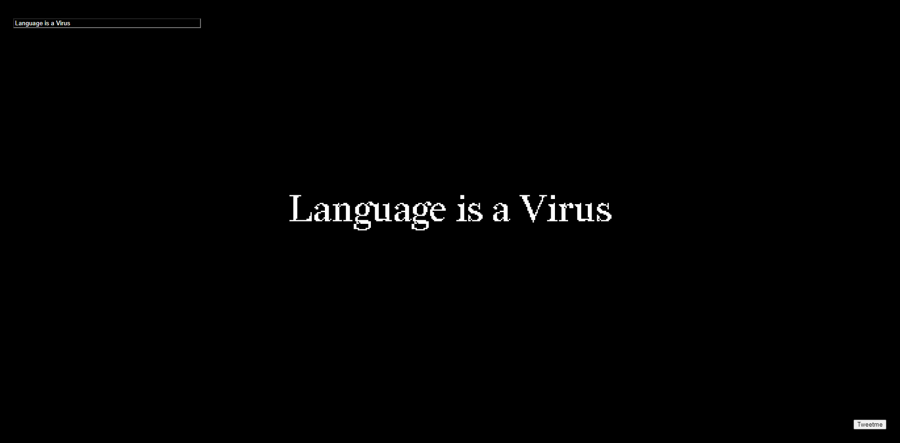

# Week 9 | Friendly Virus
##  Thinking and Rethinking 	
We were asked in class to simply work on something. It didn’t need to look anything near to our final project but aslong as you had some code, that was a start to the project. I created a sketch that had an input to represent the API sourcing text. The input text would then be displayed on the screen where the user would interact with it. Then there was a tweet me button below to send the tweet off. The typeface selected was an interesting one called redaction where the font family was various degrees of pixilation/censorship from a serif typeface to a bitmap looking one. This was just to have something on the table since I knew in class that I wanted to change my concept to something else. 

Later in the week I thought a lot about my final project and how I could change some elements to improve the message. After consulting with Karen and Andy, I came up with an alternative idea that took elements from the last but changed others. Two sketches that I found to be really beneficial were [Later date](https://laterdate.net/plans/) by Lauren Mccarthy and Jackie Gu’s [please will anyone speak to me](https://jackielgu.github.io/please-talk-to-me/). These two both had an experience where the audience is watching from a 3rd person perspective as the story unfolds. Later date creates an environment that feels simultaneously connected and distant from the digital world with ambient music and response time periods between messages. Please will anyone speak to me is also an interesting sketch where the audience must scroll to progress through the story. Both experiences created an emotional response out of the viewer. Whether that be the anticipation of waiting for a message and that excitement when the other responds, or the investment of getting deeper within a story to attempt to understand and connect.

Thinking back to my idea with the headline’s and changing of text, I think it lacked a purpose or emotional response from the viewer. Seeing words on a screen without some sort of connection felt like a project half finish so I wanted to incorporate something else. 
Here is the new proposal: Instead of having text fill the page from articles, I wanted to create some sort of conscious that the user would message and talk to. In a way like a message bot but not too forced to the point It feels completely out of touch with a human. The conscious would be a friendly virus in which it asks you a couple of y/n questions and from those would determine what to say next. Within this whole tree of dialogue, there would be a point where you enter your name and a paragraph of text. This paragraph could be something like your experience with a virus or what you think viruses should be doing in contrast to currently. Towards end things off the virus says they need to leave now as it needs to convince others that viruses aren’t all bad and as a result from your answer, (asks you for your permission) and posts a summary/thankyou tweet about how it thought your talk went with it (either positively or negatively and apologises). 

I guess what the purpose is to firstly establish some sort of connection with the user and then hopefully convince them that viruses aren’t all bad. If it’s successful then it has done its job, if not then it apologises on behalf if any other viruses that have caused damage and leaves quietly. 

Establishing a welcoming and friendly environment is fundamental in this process as most people would be coming in with a negative. The objective of this sketch is to change as many people’s opinions about viruses and will try doing so through quotes from Dibbel’s text or apologising and telling the user that no single virus is created equal. 

What’s in my brain at the moment: 
-	Use P5.play for a background animation of a sprite or friendly interpretation of a virus? 
-	Use Rive or P5.speech to create dialogue? 
[Speech Example](https://idmnyu.github.io/p5.js-speech/#examples) & [Coding Train](https://www.youtube.com/watch?v=v0CHV33wDsI&ab_channel=TheCodingTrain)

-	Use rITA to construct tweets and edit text? 
-	Still use API to post to twitter?
-	P5.js Scene Manager ( an easier way to transition between multiple artboard?) [SceneManager](https://github.com/mveteanu/p5.SceneManager)

*Possibly a little trust test could be implemented at the end with a download element where the virus asks if you trust it enough to download something? 

*Also adding a time and location would be cool to the tweet? Saying that viruses move around the internet and can be in multiple locations at once, convincing people across the world?
So that’s where my ideas at for the moment. I prefer it much more than my first one and feel a lot more motivated to work on it and hopefully refine it.

##### <= [Week 8](https://github.com/Jamtt/Codewords/blob/master/Week%208/readme.md) | Classes in Class
##### => [Week 10](https://github.com/Jamtt/Codewords/blob/master/Week_10/readme.md) | Progress

