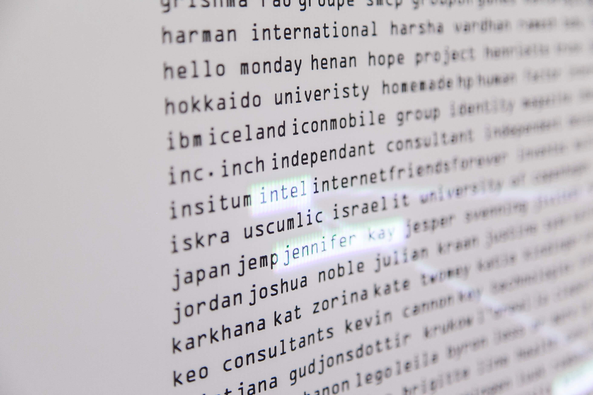

# Week 10 | Progress

## Working Away

Looking around on the web I stumbled across some rather interesting sketches. First one being Sentiment_Interactive by the ml5 team which is a analysis score from 0 to 1 (0 being negative and 1 being positive) of what the user puts in based on data sets from movie reviews. This way of taking data from human responses appealed to me however after further investigation ml5 seemed pretty difficult to get into with text. Data sets was also something that seemed overwhelming as taking the data and then assigning it a name to let the program know what it was looking for seemed cumbersome(but maybe I just didn’t look into it further enough).  
[Sentiment_Interactive](https://editor.p5js.org/ml5/sketches/Sentiment_Interactive)

This pre trained model that knew words that were common to others was also pretty interesting. Training a model seemed like teaching a kid how to talk or why words related to others. The concept I wanted to create would probably not be as smart as a kid though. 
[Training](https://editor.p5js.org/ml5/sketches/Word2Vec_Interactive)

After doing some research I decided to look into a  small AI chatbot program called RiveScript. It’s function was simple in that you would simply have a input and output and if the input matched then it would deliver the output. The dialogue segment is written in a txt file and implementation into p5.js was very possible with some tweaking. 
[RiveScript](https://www.rivescript.com/about) 

## Some random inspiration 

The Network 2016 was a super cool collaboration by Bjørn Karmann, Nicolas Armand and Daan Weijers. The project is a data visualsation that show all the people that have graduated from CIID, the countries they came from, the companies they have worked at and their years as students. It’s a combination of print media, projection and coding and I just love the way information can be displayed so creatively. 

 

>[The Network](http://bjoernkarmann.dk/thenetwork)

Another being more relevant to my sketch was a really nice processing sketch of words floating away after appearing for a certain amount of time. I think this is 100% doable in p5js with our new knowledge of classes but I didn’t think it fit with the reading I had. However an element that did appeal to me was the appearance of type in a writing manner. This was something that I really wanted in my sketch as it would subtly break the concept that you were talking to your computer and feel more human like to wait for text instead of getting instant replies like the default of RiveScript. 

> [Source](https://www.openprocessing.org/sketch/446720)

## Progress on Sketch

Within this week I attempted to tackle a couple of things. Firstly was implementing and learning more about RiveScript. This video by Yasmin Morgan was quite helpful in understanding how the various functions on RiveScript worked aswell as the official documentation on the website. The add-on was still quite limited in what it could do compared to something like p5js but I’d assume it was mainly made of beginners wanting to get into chatbot building. 
[Yasmin Morgan](https://www.youtube.com/watch?v=IhM0rmFUWGs&t=2172s&ab_channel=In-grid)

I also worked on splitting the words properly and implementing the typing animation into the reply. This was the toughest part as I attempted to use split() within a loop however it didn’t seem to work. I decided to the use a substring that was connected to a ++ timer which would reset after every reply hit its length and this seemed to do the trick. 

Some feedback that Andy gave me was that the input was way too small and there was no clear indication that the user needed to type. Creating it to be more proportional to the text would benefit clarity. Another point was that he wanted the user to always have a response as when the bot replies with “Im sorry I don’t understand” that it breaks the illusion. Coding every possible answer a human would write would be pretty difficult so for the planning of the narrative/path, I had more of a think on how to structure the paths a user would generally take. Things like the user asking “who are you”, “What do you do?” etc. 

Heres a running progress [sketch](https://jamtt.github.io/Codewords/Week%209/StartofSomething/)

##### <= [Week 9](https://github.com/Jamtt/Codewords/blob/master/Week%209/readme.md) | Friendly Virus
##### => [Week 11](https://github.com/Jamtt/Codewords/blob/master/Week_11/readme.md) | More Minecraft!

