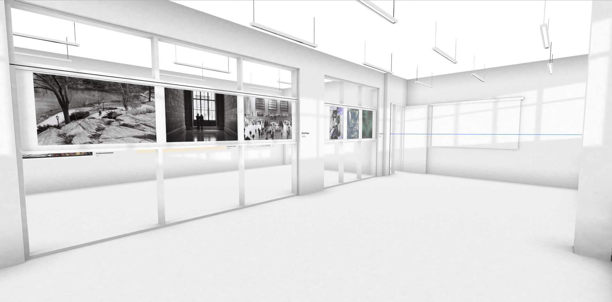
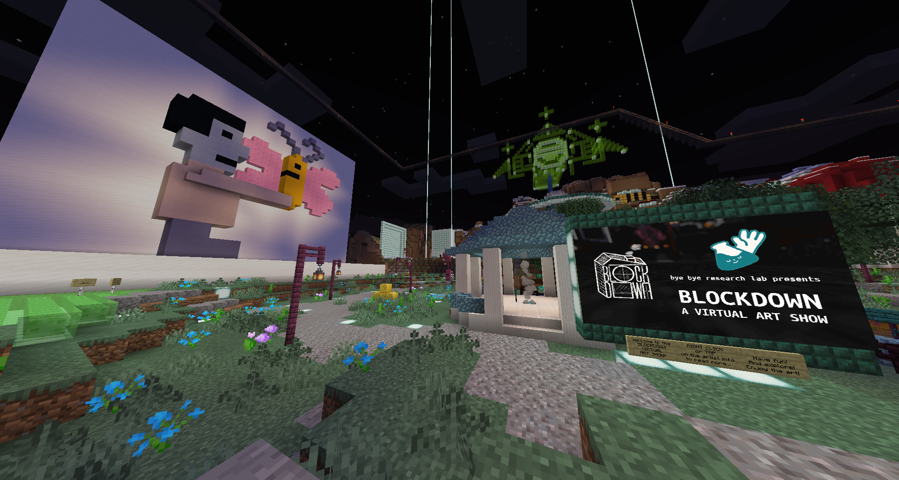
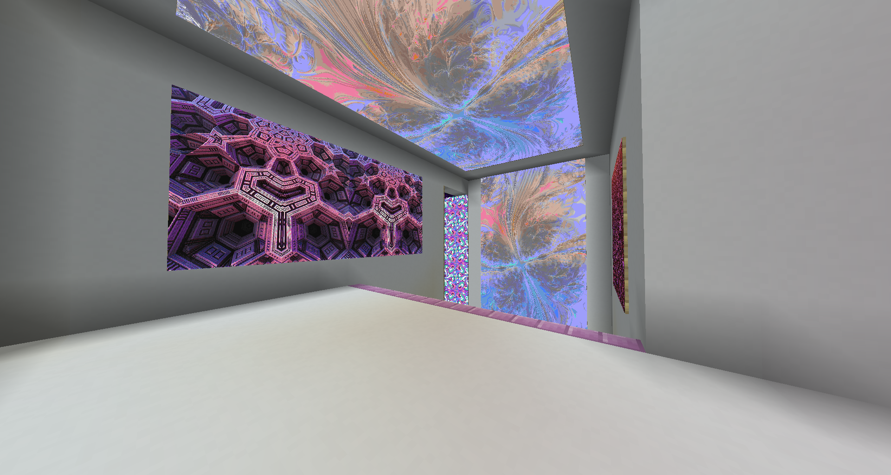
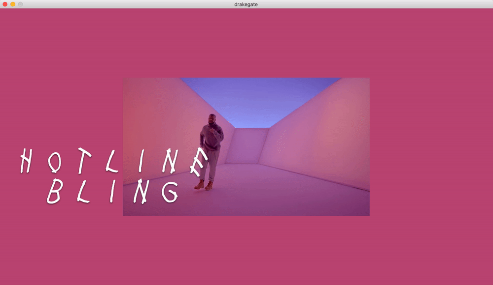
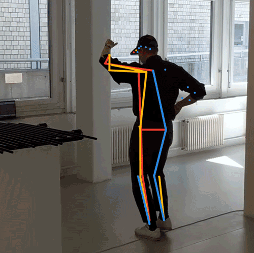
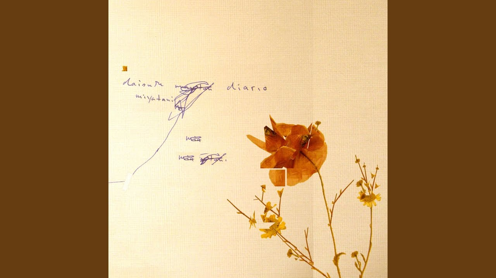

# Week 11 | More Minecraft!

## A bit more Minecraft 

As I was explaining what we exactly did in my studio to a friend and mentioning Minecraft, the Virtual art show of BLOCKDOWN was brought up. The exhibition is a collective of artists who decided to showcase their work in Minecraft using a couple of mods for displaying Images. The concept also tied into my work on progress GKO (Together Now) which was a virtual building 9 I was working on.

The concept of exploring and being immersed in a virtual space was always appealing so I really enjoyed just running around on this server and taking time looking at artwork as if In person. I’d recommend checking it out but it does require you to have the Java edition of Minecraft. 

  

> IP: play.blockdown.gallery Port: 25565 | [Vist here](https://blockdown.gallery/) 

Whilst also browsing about AI learning, I came across a super cool project about questioning solutions for authenticating users in a digital space. The project ran over three days included some really interesting ways to ‘unlock’ something with actions. My favourite being the Drake Gate where the user must preform a Drake move in order to unlock their computer. Built with p5js and processing.  

 

> Check it out [Here](https://passwords.ai/)

## Progress on the Sketch

Throughout this week, I mainly worked on some adjustments to the appearance and experience of the sketch. I knew I wanted the environment to be contrastive from what people would usually expect from a virus. No sudden pop ups, no flashing red colours or any jarring text to speech audio. It needed to be a place that reflected my intentions of convincing people that not all viruses are bad. This not only needed to be done within the appearance but also the talking tone of the bot (but more on that later). I wanted to implement p5.sound into my sketch and have a song run on loop that would fill this ambient environment. I started collecting music and found a couple songs I really liked. These included ‘Falling Asleep with a Book on Your Chest – Lullatone,  eau – yutaka hirasaka and the one I decided to use, ‘Hum’ – Daisuke Mitatani. It’s a perfect ambient song with not too much detail so it fits nicely without attracting too much attention. 

> Listen to the song [Here](https://www.youtube.com/watch?v=myeoFIVsBGg)

Secondly I decided to use the osc.freq() and osce.amp() within the p5.sound library too. This was a simple way in the library to play certain frequencies of sounds in a couple of different waveforms. I used this element within the talking of the bot to create a voice instead of having it just be the music and also assigned the frequency in the same tones as the song (A flat major). I also tried C Major full scale and in thirds but felt they were a bit too busy. 
Minor changes

Some minor appearance changes included shrinking the text size when the reply paragraph from RiveScript was too long. 

- Ensuring that when the reply.length was met, the sound of the frequencies would stop play. 

- Locking the song so it would play once the mouse was pressed by not allow the user to play it again and maintain the loop.

- Adding a slider that would change the sound of the talking and music which also changed the amplitude.getLevel() graphic. 

- Adjusting the layout composition to have better balance of visual elements. 

- Adding a match to change the colour of the background if a specific word is said by the user. (Thanks Karen for explaining match() to me). 

##### <= [Week 10](https://github.com/Jamtt/Codewords/blob/master/Week_10/readme.md) | Progress
##### => [Week 12](https://github.com/Jamtt/Codewords/blob/master/Week_12/readme.md) | Conclude
