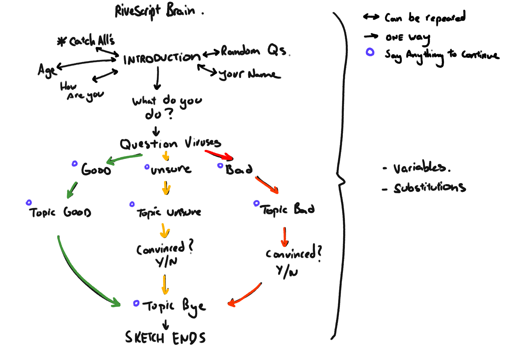
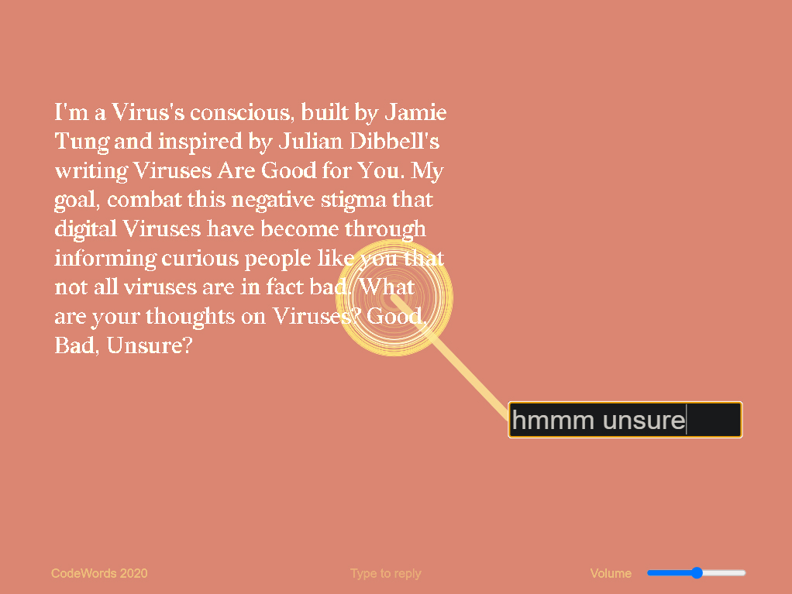

# Week 12
Time has passed so quickly that we are already in the last week of CodeWords! It’s a bit crazy looking back on these 12 weeks and seeing how much code I’ve learnt. Now I just have to retain it and keep on learning (more reflection in a bit).

## Some last-minute adjustments
Adding in responsive ratios was important to me for this project as I felt that if this view was shared it would most likely be opened in a range of different screen widths. Adjusting various things like input and reply locations and sizes all needed to be adjusted for the screen sizes. For most of these I used a else if statement to check the windowWidth size and that would match the different screen sizes. 

I also worked a lot on the RiveScript side of dialogue by create more of a structure/ pathway on how the user travels through the narrative.  Here’s a little breakdown on how the user would go though the sketch. (This is done through using topics on Rivescript to lock the user to a certain area of the script). 

## Class Presentations
During this session of class we worked on creating some assets for our sketches to be uploaded to an archive website of all our sketches in one place. Karen was live coding whilst Andy was helping out with submission questions and creating web friendly gifs and Images. Once everything was done we went through all the sketches of the class and everyone did a mini presentation on their work. It was so great to see all the progress come together into these beautiful sketches and I am very proud of what our class has been able to achieve. You can visit our class website [Here](https://simandy.github.io/codewords/). 

And you can view my final sketch [Here](https://jamtt.github.io/Codewords/Week_12/StartofSomething/ ). 

## Reflection.
So this is it. CodeWords comes to an end but the things we’ve learnt live on! I’ve always wanted to learn coding and to be able to create things that I have in my head is a new skill that I’ve developed. But as much as skills are useful, the way of thinking about the relationship of Code and Words is something that will always be of interest. I think starting this class off with the interpretation of text within a virtual space was one of my favourite activities done at Uni. It’s something that you wouldn’t expect and was so fun to just take a space that was created for gaming and make something unique out of it. You can see the playlist of them [Here](https://www.youtube.com/watch?v=uiOQQN-uh4c&list=PLUcOibqqi1kyBP6b0wt7EsPpsiJ-UzEaH).

Further in we began learning to code in p5js which I had the tiniest bit of experience from the CTRL+ project Aaron and I worked on. Learning more of its capabilities in this class unlocked the potential for how far you could go with creating things on the web. I see a lot of potential with mixing HTML CSS and P5js together to create some interesting sites that both function well and are unique in interactivity. As we mixed p5js with text it also began to spawn different ways of reading/interpreting digital literature that I had never really considered. This area felt like a mix of designing for the user experience aswell as for the actual text and I think that’s something new that could be further explored. 

Overall this class has been a pleasure to be apart of. Thankyou again to Karen Ann and Andy for just being supportive and believing in their students abilities and capabilities.

-Jamie 
